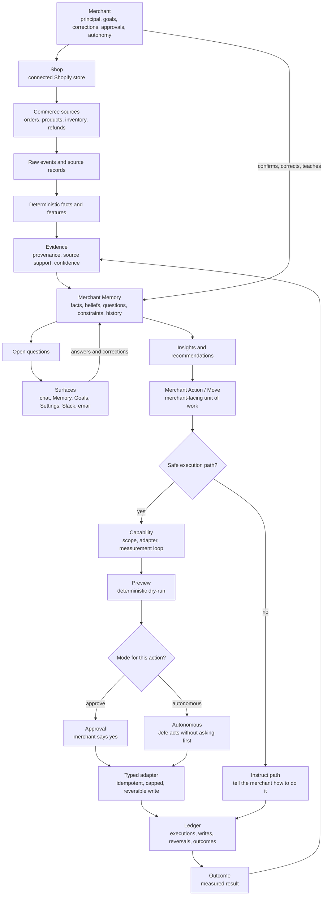

# Glossary

Jefe's shared product and system vocabulary. Keep this current when adding or
renaming product, memory, action, surface or operations entities.

## Relationship Map

Read this as the spine of the product: commerce data and merchant input become
Merchant Memory; Merchant Memory drives recommendations; recommendations either
execute through safe adapters or become clear instructions; outcomes flow back
into Memory.

The hard boundary is at the write path: LLMs may interpret evidence and propose
work, but only deterministic application code persists Memory changes, and only
typed adapters write to Shopify or another external system.

## Core

- **Jefe** — The ecommerce manager that builds Merchant Memory, recommends work, and acts through safe execution primitives.
- **Merchant** — The business principal. The merchant owns goals, corrections, approvals, autonomy settings and action authority.
- **Shop** — A connected Shopify store. Shop-scoped data stays inside that shop unless a belief is explicitly merchant-wide.
- **Merchant Memory** — Jefe's durable, structured, versioned understanding of a merchant's business.

## Memory

- **Fact** — A deterministic or merchant-confirmed statement that should not be treated as model inference.
- **Belief** — A stored claim Jefe may reason from. It carries status, confidence, provenance, audience and history.
- **Merchant-confirmed fact** — A fact the merchant has explicitly confirmed. It outranks model inference.
- **Model inference** — An LLM-interpreted claim that needs provenance and confidence, and must not silently become fact.
- **Correction** — A merchant update that supersedes current memory while preserving the replaced item's history.
- **Open question** — An unresolved uncertainty Jefe should ask the merchant about instead of guessing.
- **Evidence** — The support connecting facts, beliefs, recommendations and actions back to source records or events.
- **Source record** — A canonical commerce record, raw event or connected-source item used as evidence.
- **Provenance** — Where a claim came from and why Jefe is allowed to rely on it.
- **Confidence** — How strongly Jefe should rely on a belief or recommendation, based on evidence quality and coverage.

## Chat And Surfaces

- **Conversation** — Canonical merchant/Jefe message history across app chat, Slack, email, Goals, Plan, Memory editing and action discussion.
- **Current chat** — The selected conversation thread. Its transcript contains only messages that belong to that thread.
- **Focused action** — The one Merchant Action a conversation is currently working on. It is the only action mutation/update tools may target by default from that chat.
- **Referenced action** — A Merchant Action added to a conversation as read-only context. Jefe may reason from it, but it does not become the chat's write target.
- **Action chat** — A conversation whose `focusedActionId` points at one Merchant Action, so the merchant and Jefe can talk through that work without making other referenced actions mutable.
- **Store updates** — Store-level signals, proposed work and recent action outcomes shown near chat but kept separate from the current transcript.
- **Heads-up** — A live store signal Jefe thinks is worth knowing, such as inventory pressure or another standing condition.

## Recommendations And Actions

- **Insight** — A grounded observation about the business, shown with supporting evidence.
- **Grounded opportunity** — A deterministic, capability-aware candidate for Jefe's next recommendation. It is prepared before Luna prioritises the Plan and carries evidence, affected entities, initial proposal/state and the executable Shopify capability Jefe can bind to.
- **Recommendation** — Jefe's proposed business move, now shaped as a route to completion rather than only a single action.
- **Recommendation workflow** — The ordered steps Jefe proposes for completing one recommendation.
- **Recommendation step** — One unit of work inside a recommendation workflow; Jefe may execute it, assist it, ask for evidence, or leave it as a merchant action.
- **Action Workspace** — The outcome-oriented projection of an accepted Merchant Action. It groups the work into decisions, artifacts, executions, external waits, evidence and merchant-owned actions so Jefe can show what matters now without pretending every item is a linear lifecycle step.
- **Workspace item** — One typed item inside an Action Workspace, such as a replenishment proposal, supplier communication draft, purchase-order handoff or supplier fulfilment wait.
- **Current Focus** — The resolved next meaningful focus for a Merchant Action or workspace: a problem, merchant input, artifact review, Jefe work in progress, external wait, optional work, completion or on-track state.
- **Action scope** — The current set of products, variants or other entities a Merchant Action is acting on. The recommendation evidence seeds it, but merchant collaboration can add, remove, restore or narrow scope without rewriting the historical reason the action started.
- **Canonical replenishment proposal** — The current collaborative replenishment decision for a restock action: cover target, included products, inventory and velocity inputs, calculated quantities, overrides and an input fingerprint. Derived artifacts such as supplier emails must point back to the proposal revision they used.
- **Action Step** — The legacy-compatible workflow step inside a Merchant Action lifecycle. Workflow rows still power step runs and replanning, but the merchant-facing surface can project them through an Action Workspace when a richer outcome model is available.
- **Action Interpreter** — The focused-chat semantic layer that turns a merchant message plus current Action Runtime state into a structured plan of commands. The model understands intent; application code validates and executes. It never writes to Shopify or flips workflow status itself.
- **Action Replanner** — The focused-action service that rebuilds a recommendation workflow when the merchant changes how the work should be carried out, preserving confirmed plan values while adding, removing, replacing or reordering steps.
- **Resolved Action Context** — The one canonical current state of a Merchant Action: latest plan values, active constraints, current step, and eligible scope. Chat, Change Sets, assist artifacts and execution all read this so a merchant revision cannot exist in conversation and disappear when the step runs.
- **Step Run** — One auditable attempt to start and complete an Action Step. A Step Run records the actor, idempotency key, the input snapshot it executed against, linked execution run when one exists, timestamps, result and error metadata.
- **Needs Attention** — The lifecycle state for a step or action that cannot honestly be treated as completed, usually because execution partially applied, failed validation, needs merchant evidence, or needs a review before Jefe can continue.
- **Merchant Action** — The durable merchant-facing identity for a piece of work. It can originate from a recommendation, point at the current execution run, hold progress/outcome state, and be the focus of zero or more chats.
- **Move** — The merchant-facing unit of proposed or active work, usually surfaced as Jefe's next move.
- **Action** — A concrete change Jefe can carry out or instruct the merchant to carry out.
- **Action type** — The primitive that names a class of action, such as `price_markdown`, `listing_copy` or `tidy_up`.
- **Capability** — Whether Jefe has a safe write path, scope, adapter and measurement loop for an action type.
- **Capability state** — `DONE`, `BUILDABLE`, `NEEDS_SCOPE` or `NO_PATH`: the honest status of whether Jefe can do an action.
- **Capability availability** — The deterministic execution truth for a provider action, separate from business ownership. Examples include `AVAILABLE`, `NEEDS_AUTHORIZATION`, `NEEDS_CONFIGURATION`, `NEEDS_INPUT`, `PROVIDER_PREVIEW`, `UNSUPPORTED_BY_JEFE` and `UNSUPPORTED_BY_PROVIDER`.
- **Intended actor** — The party that should carry out a workflow item in the desired business process: `JEFE`, `MERCHANT` or `EXTERNAL`. A missing Jefe integration does not automatically change the intended actor to the merchant.
- **Shopify action capability catalog** — The source of truth for Shopify operations Jefe may reason about, including provider support, API surface/version, required scopes, Jefe implementation state, approval policy and idempotency expectations.
- **Shopify capability catalogue** — The versioned catalogue of Shopify Admin GraphQL operations Jefe can discover and semantically reason about. It names Shopify primitives such as `inventoryTransferCreate` and keeps them separate from Jefe business use cases such as restock or clearance.
- **Capability manifest** — One machine-readable Shopify operation contract. It separates technical API facts from semantic interpretation, required evidence, safety admission, scopes, executor support and version provenance.
- **Qualification plan** — The generic evidence checklist derived from a capability manifest before Jefe can turn a Shopify operation into an actionable opportunity. It asks what must be true, such as source stock existing for a transfer, without hardcoding a recommendation scenario.
- **Shopify API stub catalogue** — The generated, versioned Admin GraphQL operation surface. It answers what Shopify can technically read or mutate, what variables the operation accepts, what scopes it requires, and what GraphQL document the server may call. It is Shopify knowledge, not a Jefe feature registry.
- **Shopify API operation stub** — One generated operation entry in the stub catalogue, such as `products`, `collectionCreate` or `metafieldsSet`.
- **Shopify tool retrieval** — The runtime helper that returns a small relevant subset of Shopify API operation stubs for the current recommendation, chat or execution task.
- **Agentic Shopify recommendation loop** — Luna's recommendation run for the universal Shopify runtime: it receives Merchant Memory, bounded store evidence, compact Shopify API stubs and read tools, investigates hypotheses with generated Shopify reads, and returns a semantic recommendation only after feasibility is grounded.
- **Semantic Action materialisation** — The conversion of a recommendation into a Merchant Action defined by outcome, scope, constraints, material expected effects and verification plan, without pre-authoring a Shopify API sequence or binding a legacy action type executor.
- **External purchase order** — A merchant-owned workflow step for raising a purchase order outside Jefe when the merchant wants purchase orders but no typed purchase-order adapter exists yet.
- **Instruct path** — When Jefe cannot safely execute something, it explains how the merchant can do it themselves.

## Execution Safety

- **Typed adapter** — The deterministic module that performs an external write with validation, preview, idempotency, caps and reversal.
- **Preview** — A deterministic dry-run of exactly what an action would change before it writes anything.
- **Approval** — The merchant confirms Jefe should execute a proposed action.
- **Autonomous** — Jefe executes without asking first, but only through the same typed adapter and safety gate.
- **Blast-radius cap** — A hard bound on how many records or how much value one action can affect.
- **Idempotency key** — A stable key that prevents the same action from being applied twice.
- **Reversal** — The deterministic undo path for an action that has already written to an external system.
- **Accepted Action revision** — The semantic Action version the merchant approved. In the agentic Shopify runtime, this is the merchant authorization boundary for mutations; reads may investigate, but writes require a current accepted revision.
- **Universal Shopify gateway** — The server-side path for generated Shopify API calls. It validates the operation, API version, variables, actual granted scopes, accepted Action revision, accepted intent and blast-radius limits before the app calls Shopify.
- **Accepted-intent guard** — The generic gateway check that compares a proposed mutation's purpose and expected material effect with the merchant-approved Action. It blocks material drift such as pricing changes during a merchandising Action unless the accepted Action actually authorizes that effect.
- **Agentic Shopify execution loop** — Luna's post-acceptance execution run for a semantic Shopify Action. It chooses generated Shopify reads and writes through the universal gateway, retrieves more operation stubs as needed, observes provider results, and finishes only after reading Shopify state back to verify the accepted outcome.
- **Provider-state verification** — The completion rule that a successful Shopify write does not prove an Action is done. The runtime must read Shopify state after the write and verify the accepted outcome exists.

## Ledger And Learning

- **Action execution** — A step-linked ledger row recording a proposed, approved, applied, declined, reverted or measured action instance. Executions belong to workflow steps; a Merchant Action may point at its current execution for the merchant-facing surface.
- **Action execution write** — A row recording one external write made by an action execution.
- **Shopify operation call** — A durable ledger row for one generated Shopify Admin GraphQL operation admitted or denied by the universal gateway, covering reads and writes with operation name, variables, gateway decision, provider result summary, user errors and affected resource ids.
- **Ledger** — The durable audit trail of proposed actions, approvals, writes, reversals and outcomes.
- **Outcome** — The measured result of an action, such as units moved, cash recovered or whether a tidy-up landed.

## Onboarding And Ingestion

- **Bootstrap** — The fast first-run Merchant Memory job that reads a bounded recent window for immediate value.
- **Backfill** — The deeper background import that learns from the store's full available history.
- **Context question** — The first-run question whose answer becomes merchant-supplied memory and can reorder supported opportunities.
- **APP handoff** — The one-time transition from onboarding into the normal app home, carrying only real accepted, deferred or tracked work.

## Operations

- **Health** — The non-gating diagnostics endpoint for what the running process knows about itself right now.
- **Ready** — The readiness probe that can fail closed when a required dependency is unavailable.
