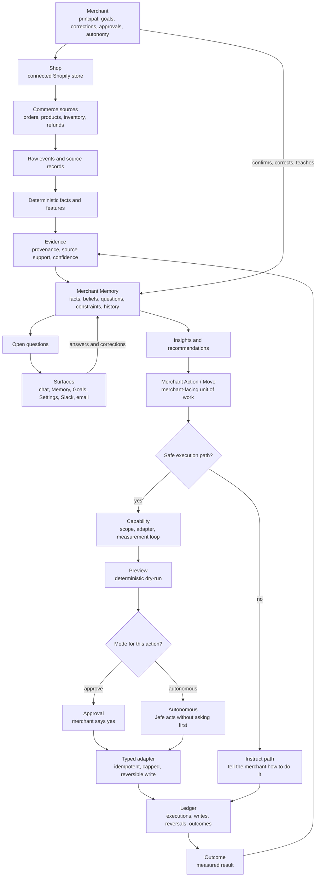

# Glossary

Jefe's shared product and system vocabulary. Keep this current when adding or
renaming product, memory, action, surface or operations entities.

## Relationship Map

Read this as the spine of the product: commerce data and merchant input become
Merchant Memory; Merchant Memory drives recommendations; recommendations either
execute through safe adapters or become clear instructions; outcomes flow back
into Memory.

The hard boundary is at the write path: LLMs may interpret evidence and propose
work, but only deterministic application code persists Memory changes, and only
typed adapters write to Shopify or another external system.

## Core

- **Jefe** — The ecommerce manager that builds Merchant Memory, recommends work, and acts through safe execution primitives.
- **Merchant** — The business principal. The merchant owns goals, corrections, approvals, autonomy settings and action authority.
- **Shop** — A connected Shopify store. Shop-scoped data stays inside that shop unless a belief is explicitly merchant-wide.
- **Merchant Memory** — Jefe's durable, structured, versioned understanding of a merchant's business.

## Memory

- **Fact** — A deterministic or merchant-confirmed statement that should not be treated as model inference.
- **Belief** — A stored claim Jefe may reason from. It carries status, confidence, provenance, audience and history.
- **Merchant-confirmed fact** — A fact the merchant has explicitly confirmed. It outranks model inference.
- **Model inference** — An LLM-interpreted claim that needs provenance and confidence, and must not silently become fact.
- **Correction** — A merchant update that supersedes current memory while preserving the replaced item's history.
- **Open question** — An unresolved uncertainty Jefe should ask the merchant about instead of guessing.
- **Evidence** — The support connecting facts, beliefs, recommendations and actions back to source records or events.
- **Source record** — A canonical commerce record, raw event or connected-source item used as evidence.
- **Provenance** — Where a claim came from and why Jefe is allowed to rely on it.
- **Confidence** — How strongly Jefe should rely on a belief or recommendation, based on evidence quality and coverage.

## Chat And Surfaces

- **Conversation** — Canonical merchant/Jefe message history across app chat, Slack, email, Goals, Plan, Memory editing and action discussion.
- **Current chat** — The selected conversation thread. Its transcript contains only messages that belong to that thread.
- **Focused action** — The one Merchant Action a conversation is currently working on. It is the only action mutation/update tools may target by default from that chat.
- **Referenced action** — A Merchant Action added to a conversation as read-only context. Jefe may reason from it, but it does not become the chat's write target.
- **Action chat** — A conversation whose `focusedActionId` points at one Merchant Action, so the merchant and Jefe can talk through that work without making other referenced actions mutable.
- **Store updates** — Store-level signals, proposed work and recent action outcomes shown near chat but kept separate from the current transcript.
- **Heads-up** — A live store signal Jefe thinks is worth knowing, such as inventory pressure or another standing condition.

## Recommendations And Actions

- **Insight** — A grounded observation about the business, shown with supporting evidence.
- **Recommendation** — Jefe's proposed business move, now shaped as a route to completion rather than only a single action.
- **Recommendation workflow** — The ordered steps Jefe proposes for completing one recommendation.
- **Recommendation step** — One unit of work inside a recommendation workflow; Jefe may execute it, assist it, ask for evidence, or leave it as a merchant action.
- **Merchant Action** — The durable merchant-facing identity for a piece of work. It can originate from a recommendation, point at the current execution run, hold progress/outcome state, and be the focus of zero or more chats.
- **Move** — The merchant-facing unit of proposed or active work, usually surfaced as Jefe's next move.
- **Action** — A concrete change Jefe can carry out or instruct the merchant to carry out.
- **Action type** — The primitive that names a class of action, such as `price_markdown`, `listing_copy` or `tidy_up`.
- **Capability** — Whether Jefe has a safe write path, scope, adapter and measurement loop for an action type.
- **Capability state** — `DONE`, `BUILDABLE`, `NEEDS_SCOPE` or `NO_PATH`: the honest status of whether Jefe can do an action.
- **Instruct path** — When Jefe cannot safely execute something, it explains how the merchant can do it themselves.

## Execution Safety

- **Typed adapter** — The deterministic module that performs an external write with validation, preview, idempotency, caps and reversal.
- **Preview** — A deterministic dry-run of exactly what an action would change before it writes anything.
- **Approval** — The merchant confirms Jefe should execute a proposed action.
- **Autonomous** — Jefe executes without asking first, but only through the same typed adapter and safety gate.
- **Blast-radius cap** — A hard bound on how many records or how much value one action can affect.
- **Idempotency key** — A stable key that prevents the same action from being applied twice.
- **Reversal** — The deterministic undo path for an action that has already written to an external system.

## Ledger And Learning

- **Action execution** — A step-linked ledger row recording a proposed, approved, applied, declined, reverted or measured action instance. Executions belong to workflow steps; a Merchant Action may point at its current execution for the merchant-facing surface.
- **Action execution write** — A row recording one external write made by an action execution.
- **Ledger** — The durable audit trail of proposed actions, approvals, writes, reversals and outcomes.
- **Outcome** — The measured result of an action, such as units moved, cash recovered or whether a tidy-up landed.

## Onboarding And Ingestion

- **Bootstrap** — The fast first-run Merchant Memory job that reads a bounded recent window for immediate value.
- **Backfill** — The deeper background import that learns from the store's full available history.
- **Context question** — The first-run question whose answer becomes merchant-supplied memory and can reorder supported opportunities.
- **APP handoff** — The one-time transition from onboarding into the normal app home, carrying only real accepted, deferred or tracked work.

## Operations

- **Health** — The non-gating diagnostics endpoint for what the running process knows about itself right now.
- **Ready** — The readiness probe that can fail closed when a required dependency is unavailable.
