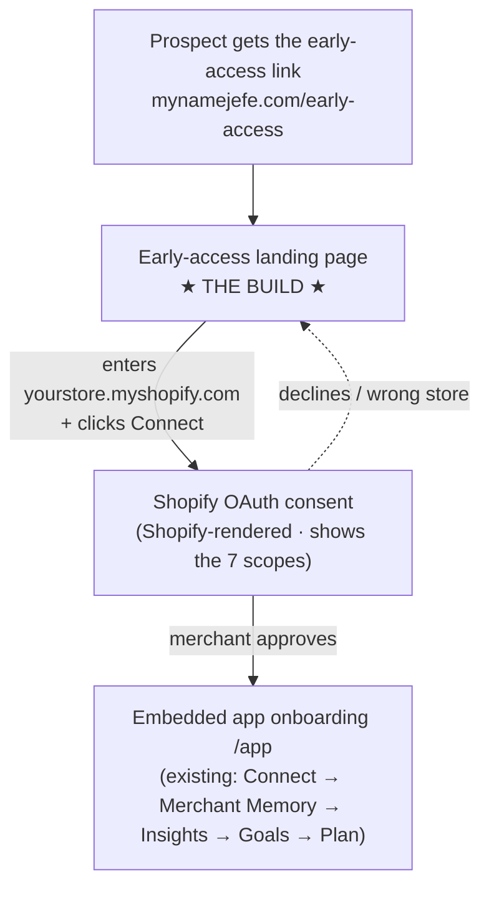

# Early-access install flow — design spec (for Claude design)

> **Owner:** Jefe chat 6 (growth). **Hand to:** a Claude design session — self-contained. Companion to [design-brief-handoff.md](design-brief-handoff.md) (App Store assets) and [shopify-app-store-launch.md](shopify-app-store-launch.md).
>
> **Why this exists:** the Shopify App Store review takes ~2 weeks, and the listing only affects *discoverability*. To onboard design partners **before** the public listing, we share an **unlisted direct install link**. Instead of dropping a prospect onto a bare Shopify OAuth screen, we send them to a **branded early-access landing page** that builds confidence, collects their store domain, and hands off to Shopify's install. **That page is the deliverable.**

## The flow (what a prospect goes through)

- **Screen 1 — the link:** shared by us (invite-only) → `mynamejefe.com/early-access`.
- **Screen 2 — early-access landing page — BUILD THIS.** Spec below.
- **Screen 3 — Shopify OAuth consent:** Shopify-rendered, *not ours to design*. Merchant sees "Jefe" + the requested scopes + **Install**. Design implication: the landing page should pre-explain "you'll approve a short list of permissions next — all reversible" so the OAuth screen isn't a surprise (a big drop-off point).
- **Screen 4 — post-install onboarding:** the existing embedded app (`/app`): Connect → Merchant Memory builds → "What Jefe knows about your business" → Insights → Goals → Plan. Optional first-run welcome state at the end of this doc.

## Screen 2 — early-access landing page (the deliverable)

**Where it lives:** a static page in `apps/marketing` served at `/early-access` — **same pattern as the `/privacy`, `/terms`, `/dpa` pages** (a standalone HTML file + a `server.mjs` route). `noindex, nofollow` (invite-only, not for search).

**Goal:** in one screen, make a warm-but-cautious DTC operator confident enough to connect their whole store. This is a **trust page**, not a marketing splash.

**Layout — single column, ~640px content, generous whitespace, warm off-white background:**

1. **Header** — Jefe wordmark (navy) top-left; a small **"Early access"** pill (gold on cream) top-right.
2. **Hero:**
   - Headline (Bricolage Grotesque, navy): **"Your AI eCommerce manager."** with an *Instrument Serif italic* accent line under it: *"Invite only — for now."*
   - Subhead (Schibsted Grotesk): "Jefe learns how your Shopify store actually works, finds your next move, and — on your terms — acts on it. You're one of a small group getting it early."
3. **The connect card (the primary action, visually elevated):**
   - Label: **"Connect your Shopify store"**
   - Input: text field showing a `.myshopify.com` suffix; placeholder `yourstore.myshopify.com`.
   - CTA (navy fill, cream text): **"Connect store →"**
   - Microcopy beneath: "You'll approve a short list of permissions on Shopify's screen next. Everything Jefe does is previewed and reversible."
4. **What happens next (3 steps — row on desktop, stacked on mobile, each with a small brand icon):**
   1. **Connect** — securely link your store (~2 min).
   2. **Jefe learns** — it builds a Merchant Memory of how your business works, which you can inspect and correct.
   3. **You stay in control** — for each action type you choose the mode: recommend, approve-then-execute, or fully autonomous. Always reversible.
5. **Trust strip (small, muted):** "Your data is used to run Jefe for you — we never sell it. [Privacy](/privacy) · [Terms](/terms)." ⟦REVIEW with Matt: add "Built by the team at Quiver" for the warm Quiver cohort, or keep Quiver unnamed? Invite-only page, so either is defensible.⟧
6. **Footer:** wordmark · "© Quiver Solutions Limited" · legal links.

**States:**
- **Default** — as above.
- **Invalid domain** — inline error under the input: "That doesn't look like a .myshopify.com store — check and try again." Validate the shape client-side.
- **Submitting** — button → spinner + "Taking you to Shopify…", then redirect.

**Behaviour (technical handoff — wire with chat 7 / product, don't guess):** on submit, normalise input to `{store}.myshopify.com` and redirect to the app's install entry — **likely** `https://jefe-production.up.railway.app/auth/login?shop={store}.myshopify.com` (the app is `@shopify/shopify-app-remix`; routes `auth.$` / `auth.login`). **Confirm the exact route with chat 7** before wiring. Shopify then renders OAuth consent (screen 3).

**Brand tokens (match `apps/marketing`):**
- Palette: navy/indigo **`#33456b`** (primary) · cream **`#f8ece7`** · dusty rose **`#c98a8a`** · warm gold **~`#dcb87a`** · warm off-white background. Dark accents = deep navy.
- Type: **Bricolage Grotesque** (display/wordmark) · **Schibsted Grotesk** (body) · **Instrument Serif** (italic accent on one emphasis word only).
- Logo: rounded-square navy mark, cream "J", dusty-rose dot (`apps/marketing/public/favicon.svg`).
- Feel: warm, premium, a little cheeky ("my name is Jefe") — but this page leans **calm + trustworthy** over cheeky (it's asking for store access). Evidence-led, unhurried.
- Fully responsive, mobile-first; the connect card stays the focal point at every size; body never scrolls horizontally.

**Copy guardrails (consistency with the App Store listing):**
- Autonomy is **from day 1, three modes** (recommend / approve-execute / autonomous) — **do not** say "advisory". Every action **reversible**; merchant always in control.
- No invented metrics or testimonials. Don't over-promise "full autopilot" or under-sell to "just recommendations".

## Optional — post-install "welcome to early access" first-run state (screen 4)

A one-time card at the top of the embedded app's first load: "Welcome to Jefe early access — you're one of the first. Start here: confirm what Jefe has learned about your store." → links into the Merchant Memory view. Nice-to-have; the existing onboarding already covers the substance.

---

## For Matt — the actual install link (technical)

Two ways to get the link the landing page forwards to:

1. **Official unlisted link (Partner Dashboard):** in the app's **Distribution → "Manage app visibility"**, set visibility to **Unlisted** and copy the install link Shopify generates. (Your action — I don't have Partner auth.) The `/early-access` page can wrap this or forward straight to the app's auth entry.
2. **Constructed OAuth entry:** `https://jefe-production.up.railway.app/auth/login?shop={store}.myshopify.com` (confirm exact route with chat 7). `client_id = c7d72018569103d47cc8dffb3980e89a`; scopes = the 7 (`read_products, write_products, read_orders, read_all_orders, read_customers, read_inventory, read_locations`).

**Remember the data gate:** installing works, but on a *live* store Jefe can't read customer/order data until the **protected-customer-data review** is approved (bundled in the app review you're submitting). So the early-access link is most powerful **after** approval — before that, demo on a development store. See [design-partner-playbook.md](design-partner-playbook.md).
